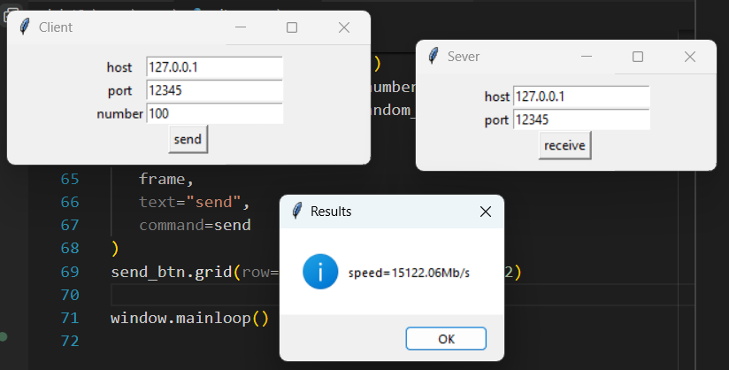
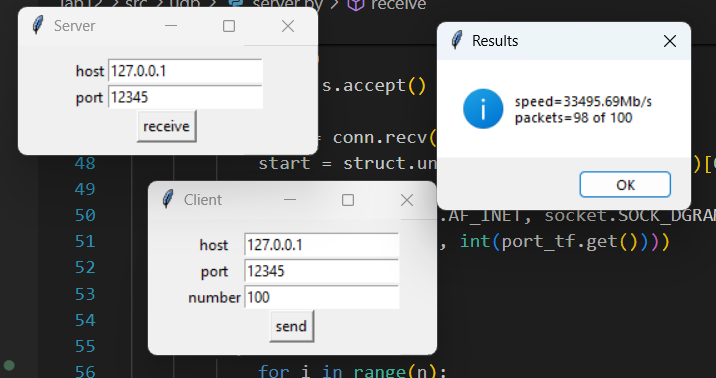

# Практика 12. Сетевой уровень

## 1. RIP (9 баллов)

### Задание А (6 баллов)
Реализуйте эмулятор работы протокола RIP в виде консольного приложения.
Ваша автономная сеть (АС) из маршрутизаторов может быть сконфигурирована на основе файла
(например, `.json`) либо генерироваться случайным образом каждый раз при запуске.

Каждый маршрутизатор должен иметь свой уникальный IP адрес. Это приложение не
предполагает передачу данных по сети, поэтому IP адреса, как и связи между маршрутизаторами,
могут быть произвольными.

Программа должна корректно работать с произвольной АС.

В конце работы программы для каждого маршрутизатора должна быть выведена таблица
маршрутизации. Пример таблицы:
```
Final state of router 198.71.243.61 table:
[Source IP]      [Destination IP]    [Next Hop]       [Metric]  
198.71.243.61    122.136.243.149     42.162.54.248           4  
198.71.243.61    157.105.66.180      42.162.54.248           2  
198.71.243.61    229.28.61.15        42.162.54.248           3  
198.71.243.61    42.162.54.248       42.162.54.248           1  
```

Приведите скрин или лог работы программы.

#### Демонстрация работы
```sh
PS C:\Users\serzh\OneDrive\Рабочий стол\net\networks-course\lab12\src\rip> python rip.py net.json   
Simulation
0 -> 1
0 -> 2
0 -> 3
0 -> 4
1 -> 0
1 -> 2
2 -> 0
2 -> 1
2 -> 3
3 -> 0
3 -> 2
4 -> 0
4 -> 5
5 -> 4
Final
src=0
dst=1 next=1 cost=1
dst=2 next=2 cost=1
dst=3 next=3 cost=1
dst=4 next=4 cost=1
dst=5 next=4 cost=2
src=1
dst=0 next=0 cost=1
dst=2 next=2 cost=1
dst=3 next=0 cost=2
dst=4 next=0 cost=2
dst=5 next=0 cost=3
src=2
dst=0 next=0 cost=1
dst=1 next=1 cost=1
dst=3 next=3 cost=1
dst=4 next=0 cost=2
dst=5 next=0 cost=3
src=3
dst=0 next=0 cost=1
dst=2 next=2 cost=1
dst=1 next=0 cost=2
dst=4 next=0 cost=2
dst=5 next=0 cost=3
src=4
dst=0 next=0 cost=1
dst=5 next=5 cost=1
dst=1 next=0 cost=2
dst=2 next=0 cost=2
dst=3 next=0 cost=2
src=5
dst=4 next=4 cost=1
dst=0 next=4 cost=2
dst=1 next=4 cost=3
dst=2 next=4 cost=3
dst=3 next=4 cost=3
```

### Задание Б (1 балл)
Выведите на консоль промежуточные этапы работы протокола: по каждому маршрутизатору
должна быть выведена его текущая таблица маршрутизации.

```
Simulation step 3 of router 42.162.54.248
[Source IP]      [Destination IP]    [Next Hop]       [Metric]  
42.162.54.248    122.136.243.149     157.105.66.180          3  
42.162.54.248    157.105.66.180      157.105.66.180          1  
42.162.54.248    229.28.61.15        157.105.66.180          2  
42.162.54.248    198.71.243.61       198.71.243.61           1  
```

#### Демонстрация работы
```sh
Simulation
0 -> 1
0 -> 2
0 -> 3
0 -> 4
1 -> 0
1 -> 2
2 -> 0
2 -> 1
2 -> 3
3 -> 0
3 -> 2
4 -> 0
4 -> 5
5 -> 4
Step 1
src=0
dst=1 next=1 cost=1
dst=2 next=2 cost=1
dst=3 next=3 cost=1
dst=4 next=4 cost=1
src=1
dst=0 next=0 cost=1
dst=2 next=2 cost=1
src=2
dst=0 next=0 cost=1
dst=1 next=1 cost=1
dst=3 next=3 cost=1
src=3
dst=0 next=0 cost=1
dst=2 next=2 cost=1
src=4
dst=0 next=0 cost=1
dst=5 next=5 cost=1
src=5
dst=4 next=4 cost=1
Step 2
src=0
dst=1 next=1 cost=1
dst=2 next=2 cost=1
dst=3 next=3 cost=1
dst=4 next=4 cost=1
dst=5 next=4 cost=2
src=1
dst=0 next=0 cost=1
dst=2 next=2 cost=1
dst=3 next=0 cost=2
dst=4 next=0 cost=2
src=2
dst=0 next=0 cost=1
dst=1 next=1 cost=1
dst=3 next=3 cost=1
dst=4 next=0 cost=2
src=3
dst=0 next=0 cost=1
dst=2 next=2 cost=1
dst=1 next=0 cost=2
dst=4 next=0 cost=2
src=4
dst=0 next=0 cost=1
dst=5 next=5 cost=1
dst=1 next=0 cost=2
dst=2 next=0 cost=2
dst=3 next=0 cost=2
src=5
dst=4 next=4 cost=1
dst=0 next=4 cost=2
Step 3
src=0
dst=1 next=1 cost=1
dst=2 next=2 cost=1
dst=3 next=3 cost=1
dst=4 next=4 cost=1
dst=5 next=4 cost=2
src=1
dst=0 next=0 cost=1
dst=2 next=2 cost=1
dst=3 next=0 cost=2
dst=4 next=0 cost=2
dst=5 next=0 cost=3
src=2
dst=0 next=0 cost=1
dst=1 next=1 cost=1
dst=3 next=3 cost=1
dst=4 next=0 cost=2
dst=5 next=0 cost=3
src=3
dst=0 next=0 cost=1
dst=2 next=2 cost=1
dst=1 next=0 cost=2
dst=4 next=0 cost=2
dst=5 next=0 cost=3
src=4
dst=0 next=0 cost=1
dst=5 next=5 cost=1
dst=1 next=0 cost=2
dst=2 next=0 cost=2
dst=3 next=0 cost=2
src=5
dst=4 next=4 cost=1
dst=0 next=4 cost=2
dst=1 next=4 cost=3
dst=2 next=4 cost=3
dst=3 next=4 cost=3
Final
src=0
dst=1 next=1 cost=1
dst=2 next=2 cost=1
dst=3 next=3 cost=1
dst=4 next=4 cost=1
dst=5 next=4 cost=2
src=1
dst=0 next=0 cost=1
dst=2 next=2 cost=1
dst=3 next=0 cost=2
dst=4 next=0 cost=2
dst=5 next=0 cost=3
src=2
dst=0 next=0 cost=1
dst=1 next=1 cost=1
dst=3 next=3 cost=1
dst=4 next=0 cost=2
dst=5 next=0 cost=3
src=3
dst=0 next=0 cost=1
dst=2 next=2 cost=1
dst=1 next=0 cost=2
dst=4 next=0 cost=2
dst=5 next=0 cost=3
src=4
dst=0 next=0 cost=1
dst=5 next=5 cost=1
dst=1 next=0 cost=2
dst=2 next=0 cost=2
dst=3 next=0 cost=2
src=5
dst=4 next=4 cost=1
dst=0 next=4 cost=2
dst=1 next=4 cost=3
dst=2 next=4 cost=3
dst=3 next=4 cost=3
```

### Задание В (2 балла)

Реализуйте имитацию работы маршрутизаторов в виде отдельных потоков на примере
приложения, рассмотренного на занятии.

Бонус: Не используйте общую память, а вместо этого реализуйте общение потоков через 
сокеты **(+3 балла)**.

## Скорость передачи (6 баллов)
Реализуйте программу, которая измеряет скорость передачи информации по протоколам TCP и
UDP, а также выводит количество потерянных пакетов.

Программа состоит из двух частей: клиента и сервера. Клиент создает трафик случайным образом
(т.е. генерируется случайная последовательность данных) и отправляет их на сервер. Сервер
подсчитывает количество полученных данных и выводит результат. Время отправки указывается
клиентом вместе с данными.

Ваше приложение должно иметь GUI.

### 1. Измерение по протоколу TCP (3 балла)
Пример интерфейса:


#### Демонстрация работы


### 2. Измерение по протоколу UDP (3 балла)
Пример интерфейса:


#### Демонстрация работы

   

## Транслятор портов (6 баллов)
Разработать приложение – транслятор портов. Трансляция осуществляется в соответствии с
набором правил трансляции, заданных в конфигурационном файле. Каждое правило должно
указывать, с какого порта на какие IP адрес и порт транслировать. При изменении
конфигурационного файла новые правила должны вступать в действие, но установленные
соединения не должны разрываться. В программе должен быть реализован GUI.

Пример GUI:


#### Демонстрация работы
todo
